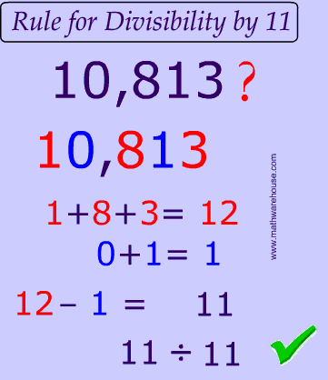

 
# Notes

### Divisibility Rules

| Number  | Ex:                                                         |
|---------|-------------------------------------------------------------|
| by `2`  | When last digit is even number ex: _12, 90, 32_             |
| by `3`  | When sum of digits is divisible by 3 ex: _12, 93, 63_       |
| by `4`  | When last two digits is divisible by _2_ ex: _112, 44, 434_ |
| by `5`  | When last digit is _0_ or _5_ ex: _50, 105_                 |
| by `6`  | When the number is divisible by 2 and 3 ex: _12, 144_       |
| by `8`  | When the last three digits is divisible by _8_ ex: 12316    |
| by `9`  | When sum of all digits is divisible by _9_  ex:62136        |
| by `10` | When last digit is _0_ ex: _110, 230_                       |
| by `11` | When any alternative digits to produce _11_, see below      |

